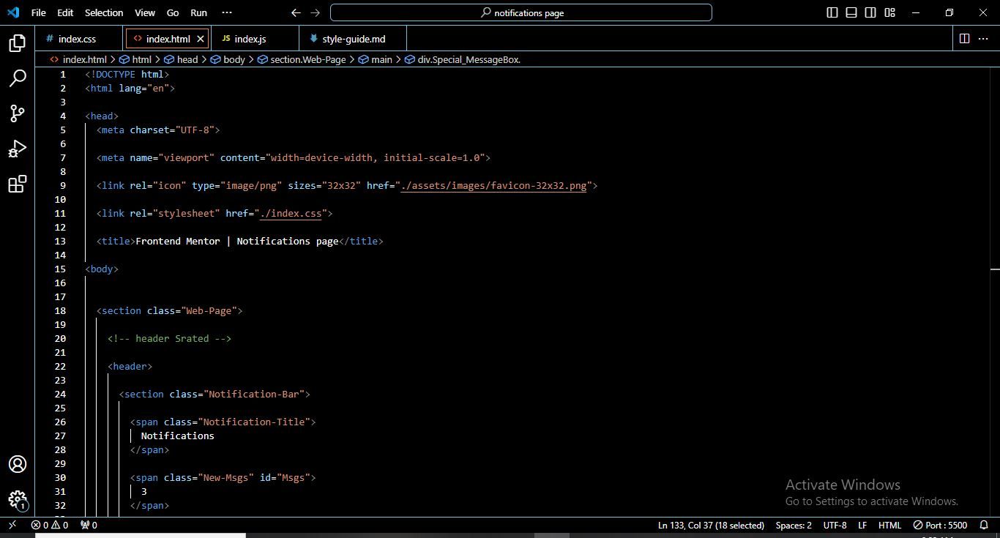
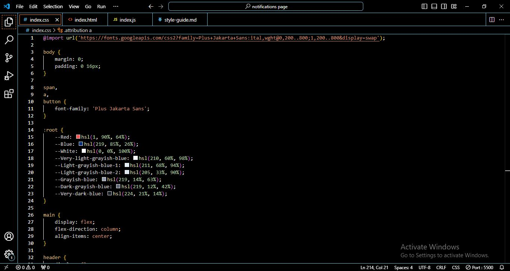
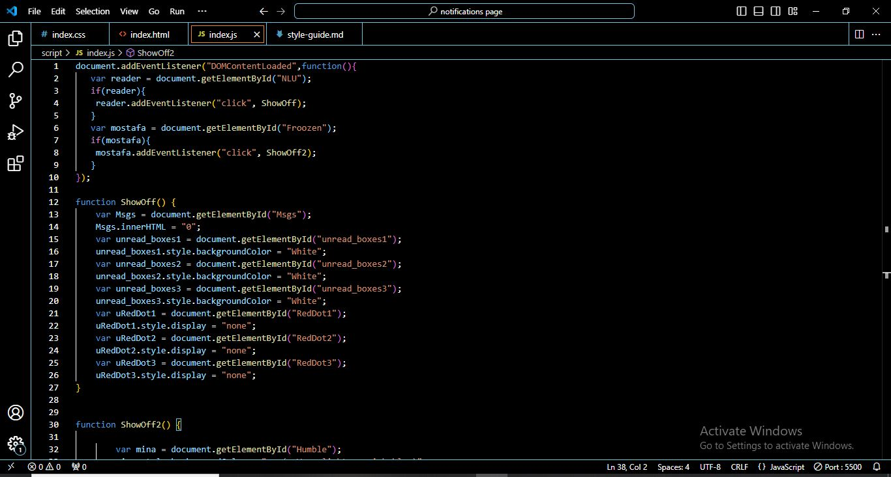
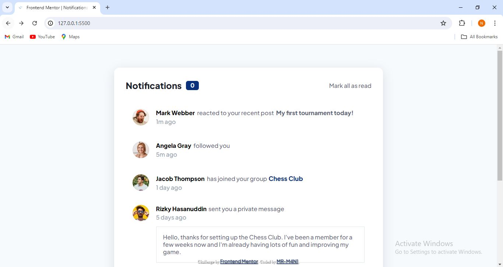
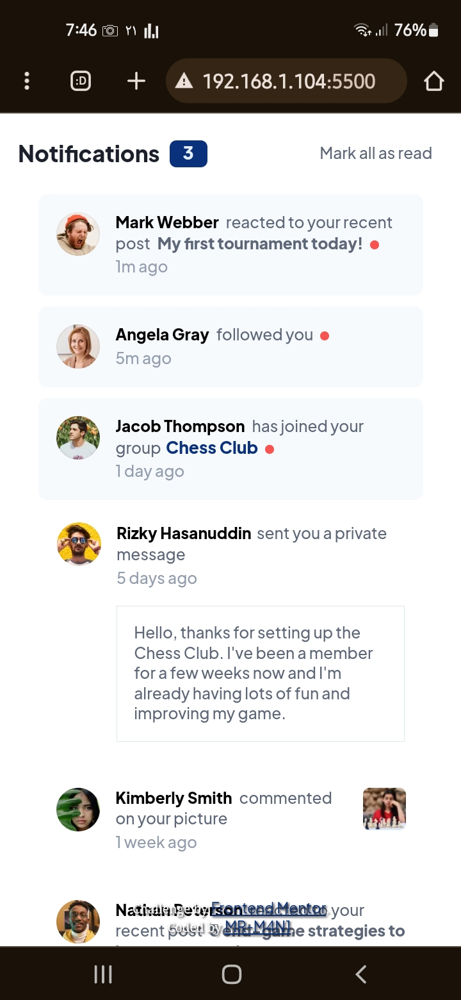
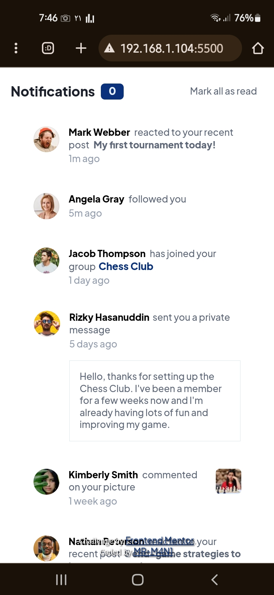

## Table of contents

- [Overview](#overview)
  - [The challenge](#the-challenge)
  - [Screenshot](#screenshot)
  - [Links](#links)
  - [Built with](#built-with)
  - [What I learned](#what-i-learned)
  - [Continued development](#continued-development)
  - [Useful resources](#useful-resources)
- [Author](#author)
- [Acknowledgments](#acknowledgments)

## Overview

### The challenge

- YOU CAN SEE THE CHALLENG BY CLICKING : [CHALLENG](https://www.frontendmentor.io/challenges/notifications-page-DqK5QAmKbC/hub)
### Screenshot

### Links

- Solution URL: [GIT_URL](https://github.com/MR-M4N1/Notifications_page)
- Live Site URL: [GIT_LIV](https://mr-m4n1.github.io/Notifications_page/)

## My process

### Built with

- Semantic HTML5 markup
- CSS custom properties
- Flexbox
- Mobile-first workflow

### What I learned

-----------------------------------------

### Continued development

--------------------------------------------

### Useful resources

----------------------------------------

## Author

- Frontend Mentor - [@MR-M4N1](https://www.frontendmentor.io/profile/MR-M4N1)

## Acknowledgments

-----------------------------------------------
